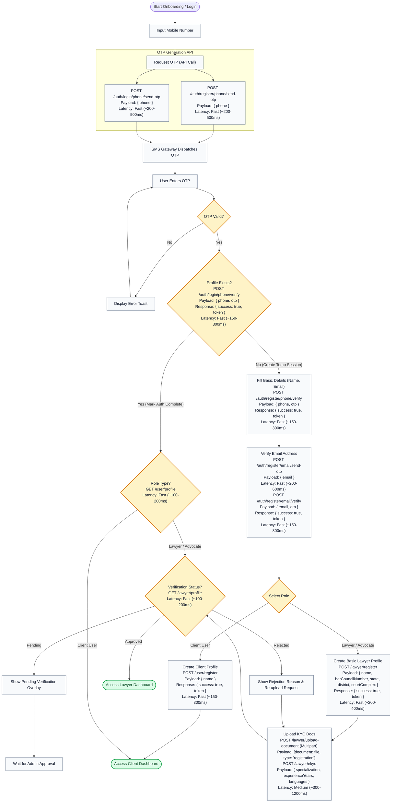
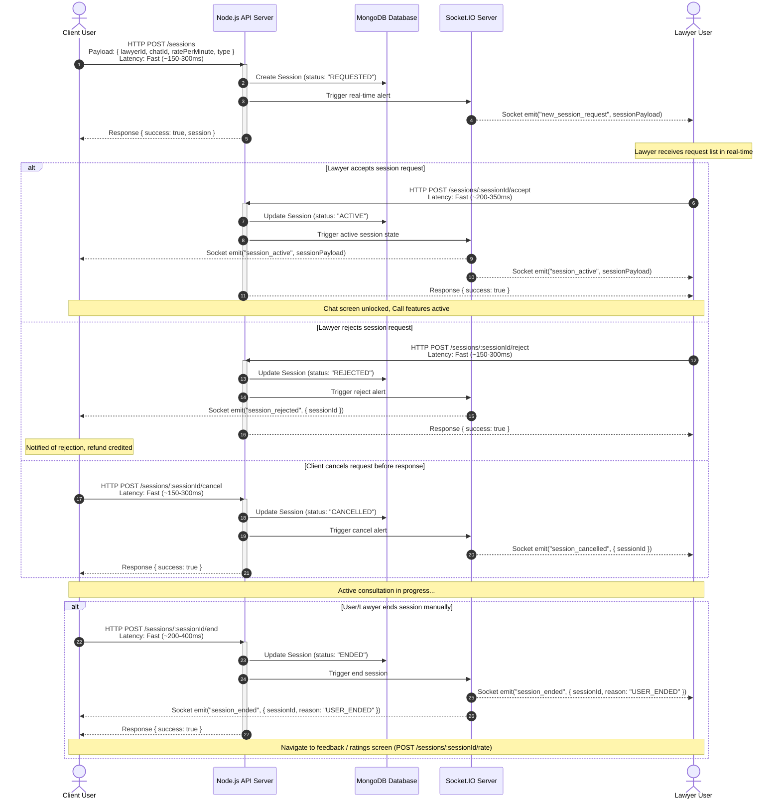
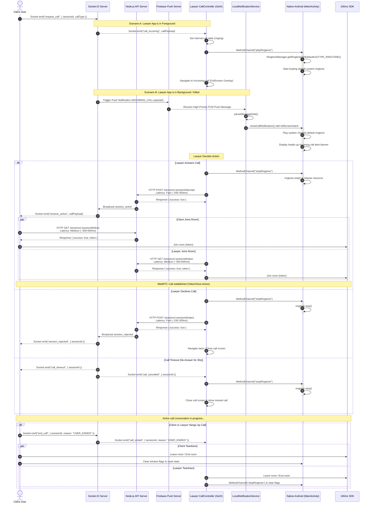
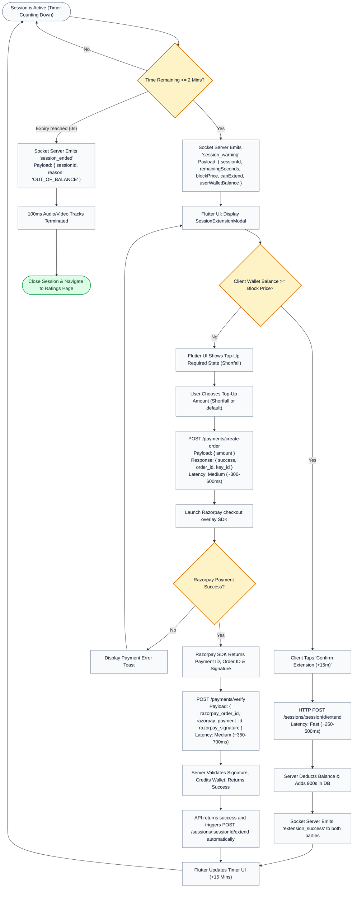
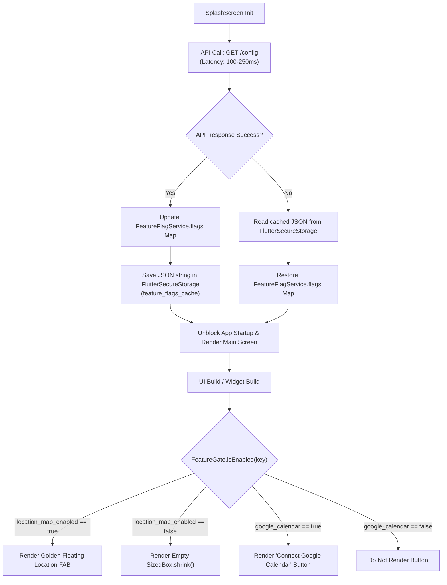

# ⚖️ LAWL - Detailed Workflow Diagrams

This document provides a highly detailed walkthrough of the core workflows in the **Lawl** mobile application ecosystem. It highlights how the Flutter frontend (using GetX state management), Node.js backend, Socket.IO real-time server, native Android platform channels, and third-party integrations (100ms, Razorpay, FCM, eCourts) work together.

---

## 1. Master System Architecture Flowchart
The following diagram maps the entire system components, showing the interactions between the client applications, backend, socket servers, and third-party integrations.

```mermaid
graph TD
    %% Styling
    classDef client fill:#e0f2fe,stroke:#0284c7,stroke-width:2px,color:#0f172a;
    classDef server fill:#fef3c7,stroke:#d97706,stroke-width:2px,color:#0f172a;
    classDef external fill:#f3e8ff,stroke:#7c3aed,stroke-width:2px,color:#0f172a;

    subgraph Clients ["Flutter Mobile Apps (GetX State)"]
        ClientApp["Client App UI & Controllers"]
        LawyerApp["Lawyer App UI & Controllers"]
        PlatformChannel["Platform Channel (MethodChannel)"]
        NativeRingtone["Android RingtoneManager / iOS Audio"]
        FeatureFlagService["FeatureFlagService & FeatureGate"]
    end

    subgraph BackendServices ["Backend & Realtime Services"]
        APIServer["Node.js API Server (REST)<br/>Base URL: https://api.lawl.app/api<br/>Port: 443 HTTPS"]
        SocketServer["Socket.IO Server (Signaling)<br/>Host: https://api.lawl.app<br/>Port: 443 WSS"]
        Database[("MongoDB Database")]
    end

    subgraph ThirdParty ["Third-Party Service Providers"]
        FCM["Firebase Cloud Messaging (FCM)"]
        HMS["100ms SDK (WebRTC Rooms)"]
        Razorpay["Razorpay Payment Gateway"]
        eCourtsScraper["eCourts Portal / Scraper"]
    end

    %% Client Relations
    ClientApp -- "HTTP REST APIs" --> APIServer
    ClientApp -- "Websocket WSS Connection" --> SocketServer
    LawyerApp -- "HTTP REST APIs" --> APIServer
    LawyerApp -- "Websocket WSS Connection" --> SocketServer
    FeatureFlagService -- "GET /config (Latency: 100-250ms)" --> APIServer

    %% Native Channels
    LawyerApp <--> PlatformChannel
    PlatformChannel <--> NativeRingtone

    %% Backend Relations
    APIServer <--> Database
    SocketServer <--> Database
    APIServer -.-> FCM
    
    %% Third Party Connections
    ClientApp <--> Razorpay
    ClientApp <--> HMS
    LawyerApp <--> HMS
    APIServer <--> HMS
    APIServer <--> eCourtsScraper

    %% Apply Styling Classes
    class ClientApp,LawyerApp,PlatformChannel,NativeRingtone,FeatureFlagService client;
    class APIServer,SocketServer,Database server;
    class FCM,HMS,Razorpay,eCourtsScraper external;
```



---

## 2. Onboarding & Authentication Workflow
This flowchart outlines the process of user registration, role selection, and the lawyer verification pipeline (KYC approval/rejection) with exact API endpoints, request/response payload details, and average latencies.



---

## 3. Session Lifecycle & Socket Signaling
Consultations in LAWL are structured around a **Session-First** flow, where chat/call features are only enabled inside an active session. State transitions are requested via secure HTTP endpoints, and real-time updates are pushed via Socket.IO.



---

## 4. Call Lifecycle & Native Ringtone Flow
This sequence diagram details how calls are initiated, how the native system ringtone loops are activated in foreground/background states, how WebRTC is joined using the 100ms SDK, and how teardown works.



---

## 5. Wallet, Billing, & Auto-Extension Flow
To maintain active sessions, the system monitors wallet balance, alerts the user, and automates extensions using Razorpay integration.



---

## 6. eCourts Scraper & Case Management Flow
This diagram details how advocates can search and add cases to their dashboard by either scanning a physical QR code or performing a query against state/district filters, scraper logic, and multi-result picking. Captchas and session cookies are automated backend-side.

```mermaid
flowchart TD
    %% Styling
    classDef source fill:#f8fafc,stroke:#475569,stroke-width:1.5px,color:#0f172a;
    classDef process fill:#eff6ff,stroke:#2563eb,stroke-width:1.5px,color:#1e3a8a;
    classDef decision fill:#fef3c7,stroke:#d97706,stroke-width:2px,color:#0f172a;
    classDef success fill:#dcfce7,stroke:#16a34a,stroke-width:2px,color:#14532d;
    classDef error fill:#fee2e2,stroke:#dc2626,stroke-width:1.5px,color:#7f1d1d;

    StartCaseAdd(["Lawyer Dashboard: Add eCourts Case"]) --> ChooseMethod{"Choose Addition Method"}
    
    ChooseMethod -- "Scan QR Code" --> OpenScanner["Launch Mobile Scanner SDK"]
    OpenScanner --> ScanQR["Scan Physical Case Sheet QR Code"]
    ScanQR --> ExtractCNR["Extract CNR Number String"]
    ExtractCNR --> APIRequestCNR["HTTP POST /cases/ecourt/scan<br/>Payload: { cnr }<br/>Latency: Slow/Scraping (~3.0s - 12.0s)"]
    
    ChooseMethod -- "Manual Filter Search" --> SelectLocation["Select State & District"]
    SelectLocation --> SelectCourt["Select Court Complex"]
    SelectCourt --> EnterCaseDetails["Enter Case Type, Case Number, & Year"]
    EnterCaseDetails --> APIRequestManual["HTTP POST /cases/ecourt/search<br/>Payload: { state_code, dist_code, court_complex_code, case_type, case_no, year }<br/>Latency: Slow/Scraping (~3.0s - 15.0s)"]

    APIRequestCNR --> BackendScrape["Backend Scraper Solves Captchas & Scrapes eCourts Portal"]
    APIRequestManual --> BackendScrape
    
    BackendScrape --> ScrapeResult{"Parse Scrape Results"}
    
    ScrapeResult -- "Error / Not Found" --> ErrorState["Return Scrape Failed Event"]
    ErrorState --> ShowErrorToast["Flutter UI: Display Error Alert Banner"]
    ShowErrorToast --> StartCaseAdd

    ScrapeResult -- "Multiple Cases Match" --> ReturnMultiList["Return Matching Cases Index List<br/>Response: { success: true, multiple: true, cases: [...] }"]
    ReturnMultiList --> DisplayPicker["Flutter UI: Display Selection Picker Sheet"]
    DisplayPicker --> UserSelectsCase["Lawyer Selects Exact Target Case"]
    UserSelectsCase --> APIRequestSelect["HTTP POST /cases/ecourt/select<br/>Payload: { caseInfo }<br/>Latency: Slow/Scraping (~2.0s - 8.0s)"]
    APIRequestSelect --> FetchFullDetails["Backend Scrapes Selected Case Details Page"]
    FetchFullDetails --> SaveToDB

    ScrapeResult -- "Single Direct Match" --> SaveToDB["Backend Saves Case Model to MongoDB Database"]
    
    SaveToDB --> ReturnCaseModel["Return Structured CaseModel JSON<br/>Response: { success: true, case }"]
    ReturnCaseModel --> InsertLocalState["EcourtCaseController: cases.insert(0, saved)"]
    InsertLocalState --> SyncUpcomingHearings["Sort Cases & Update Upcoming Hearing Date Alerts"]
    SyncUpcomingHearings --> SuccessView(["Case Dashboard Refreshed with New Case Tracking"])

    class OpenScanner,ScanQR,ExtractCNR,APIRequestCNR,SelectLocation,SelectCourt,EnterCaseDetails,APIRequestManual,BackendScrape,ErrorState,ShowErrorToast,ReturnMultiList,DisplayPicker,UserSelectsCase,APIRequestSelect,FetchFullDetails,SaveToDB,ReturnCaseModel,InsertLocalState,SyncUpcomingHearings source;
    class ChooseMethod,ScrapeResult decision;
    class SuccessView success;
    class ShowErrorToast error;
```



---

## 7. Feature Gates & Configuration System
To support flexible toggles and region-specific launches, LAWL implements a dynamic Feature Gate system loading configurations from the backend.

### 7.1 Architecture Overview
- **Startup Fetching**: The `SplashScreen` fetches the master flags during initialization via the REST API endpoint `GET /config` (Latency: ~100-250ms).
- **Caching Mechanism**: The `FeatureFlagService` persists the key-value toggles locally using secure storage (`FlutterSecureStorage` under cache key `feature_flags_cache`). This prevents visual flickering when navigating screens.
- **Auto-Refresh**: Toggles are automatically re-fetched in the background on application resume events via `WidgetsBindingObserver`.
- **Runtime Evaluation**: UI widgets evaluate flags using the static class `FeatureGate.isEnabled(key)` or `FeatureGate.evaluate(key)`. The evaluation yields specific `FeatureBehavior` parameters (e.g. `show`, `hide`, `showComingSoon`, `showDisabledState`).

### 7.2 Feature Flags & Code References

#### 1. `location_map_enabled` (Boolean)
- **Description**: Governs the interactive client-side map displaying available nearby advocates.
- **FAB Toggle (`user_main_screen.dart:L85`)**: If evaluated to `false`, the bottom center Floating Action Button is completely hidden (returns `SizedBox.shrink()`).
- **Screen Gate (`lawyers_near_me_screen.dart:L179`)**: If user navigates directly and the flag is disabled, it bypasses permission requests and renders a fallback "Map View Unavailable" warning screen. If enabled, it initializes geolocation trackers and requests nearby lawyers from the endpoint:
  ```http
  GET /lawyer/nearby?lat={latitude}&lng={longitude}&radiusKm=20
  Headers: Authorization: Bearer {token}
  Latency: Fast (~150-300ms)
  ```

#### 2. `google_calendar` (Boolean)
- **Description**: Dictates whether lawyer calendar views show external Google Calendar sync utilities.
- **Calendar Integration (`lawyer_calendar_screen.dart:L419`)**: When set to `true`, the collapsing persistent calendar sliver displays the styled outline button to connect and synchronize calendar integrations:
  ```dart
  // Triggers Google OAuth callback integration:
  _ctrl.connectGoogleCalendar()
  ```
  If set to `false`, the synchronization button is skipped from rendering.

### 7.3 Lifecycle of Feature Flags


