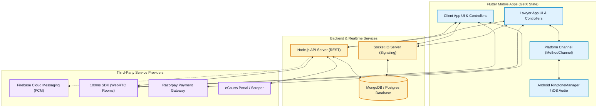
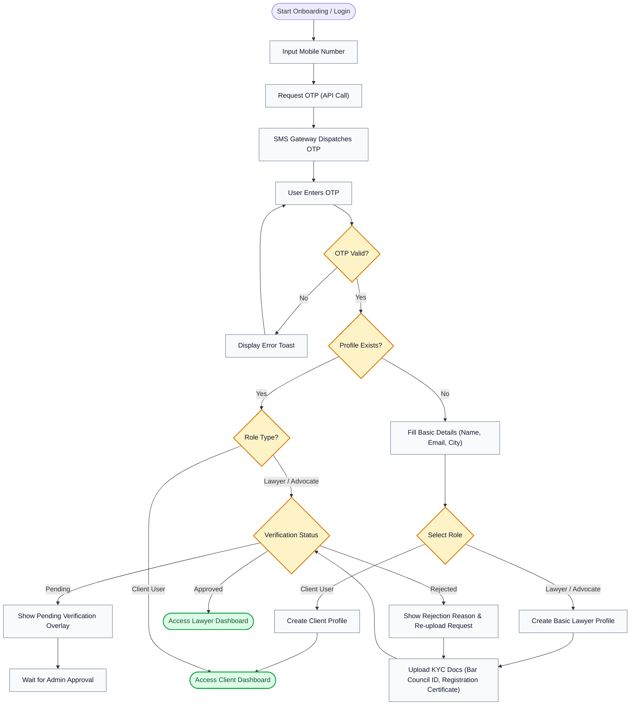
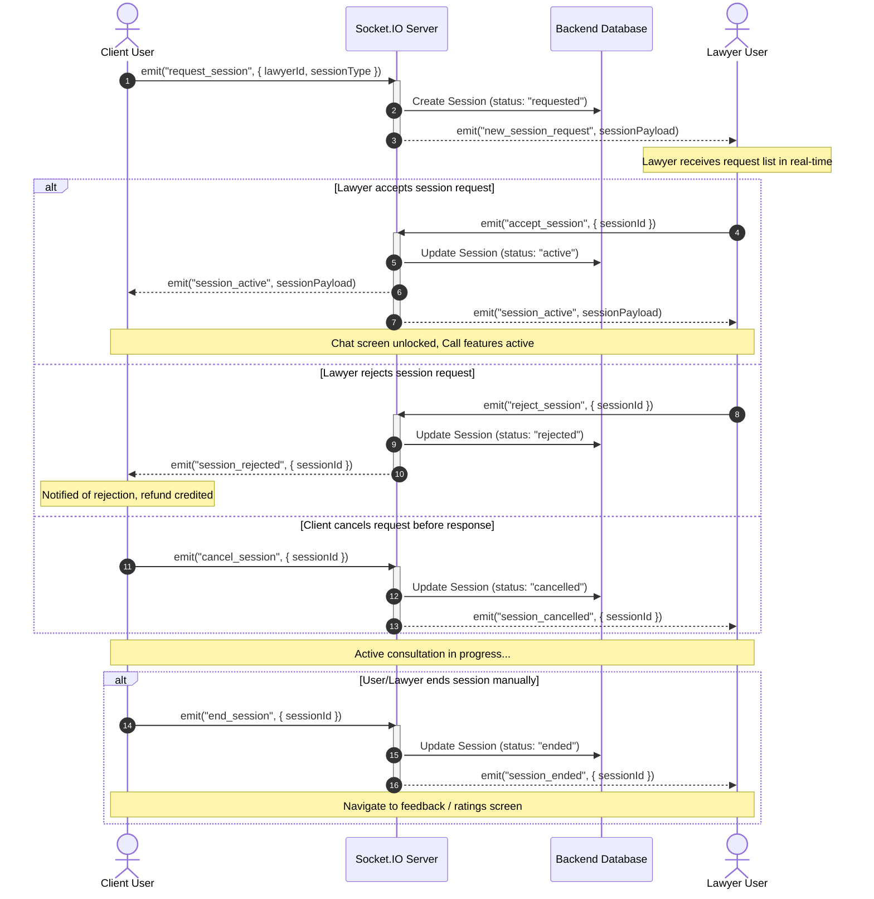
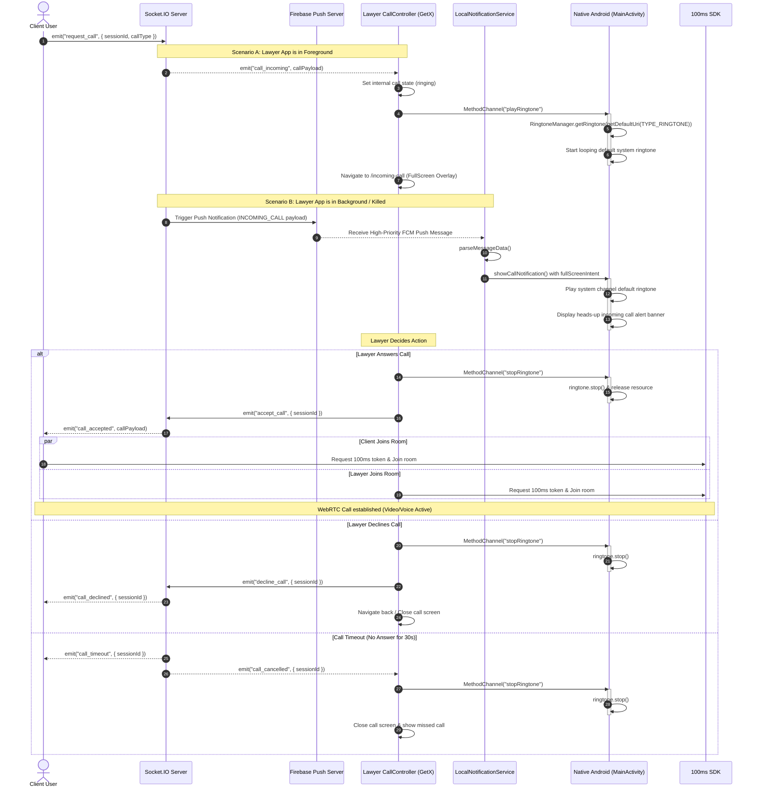
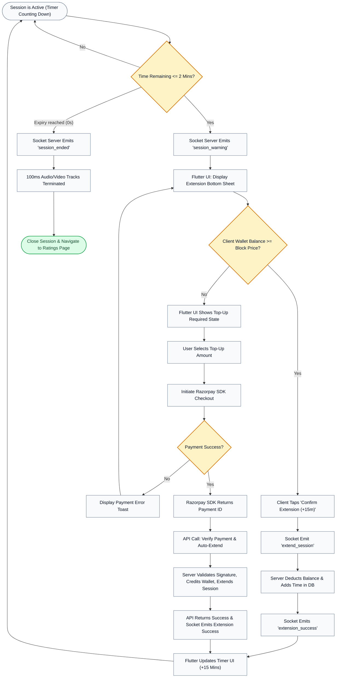
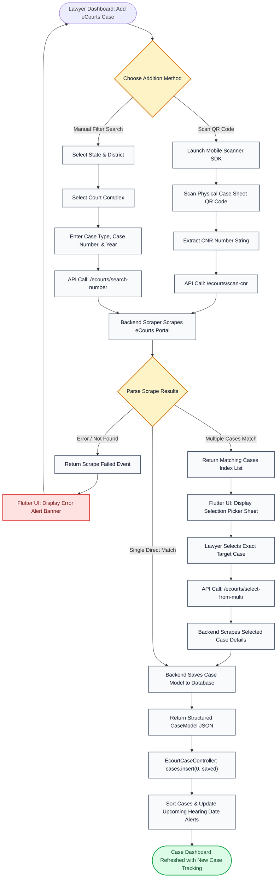

# ⚖️ LAWL - Detailed Workflow Diagrams

This document provides a highly detailed walkthrough of the core workflows in the **Lawl** mobile application ecosystem. It highlights how the Flutter frontend (using GetX state management), Node.js backend, Socket.IO real-time server, native Android platform channels, and third-party integrations (100ms, Razorpay, FCM, eCourts) work together.

---

## 1. Master System Architecture Flowchart
The following diagram maps the entire system components, showing the interactions between the client applications, backend, socket servers, and third-party integrations.

---

## 2. Authentication & Onboarding Workflow
This flowchart outlines the process of user registration, role selection, and the lawyer verification pipeline (KYC approval/rejection).

---

## 3. Session Lifecycle & Socket Signaling
Consultations in LAWL are structured around a **Session-First** flow, where chat/call features are only enabled inside an active session.

---

## 4. Call Lifecycle & Native Ringtone Flow
This flow details how real-time call requests invoke native ringtone loop mechanisms in both foreground and background states, transitioning into WebRTC video/voice sessions via the 100ms SDK.

---

## 5. Wallet, Billing, & Auto-Extension Flow
To maintain active sessions, the system monitors wallet balance, alerts the user, and automates extensions using Razorpay integration.

---

## 6. eCourts Scraper & Case Management Flow
This diagram details how advocates can search and add cases to their dashboard by either scanning a physical QR code or performing a query against state/district filters, scraper logic, and multi-result picking.

